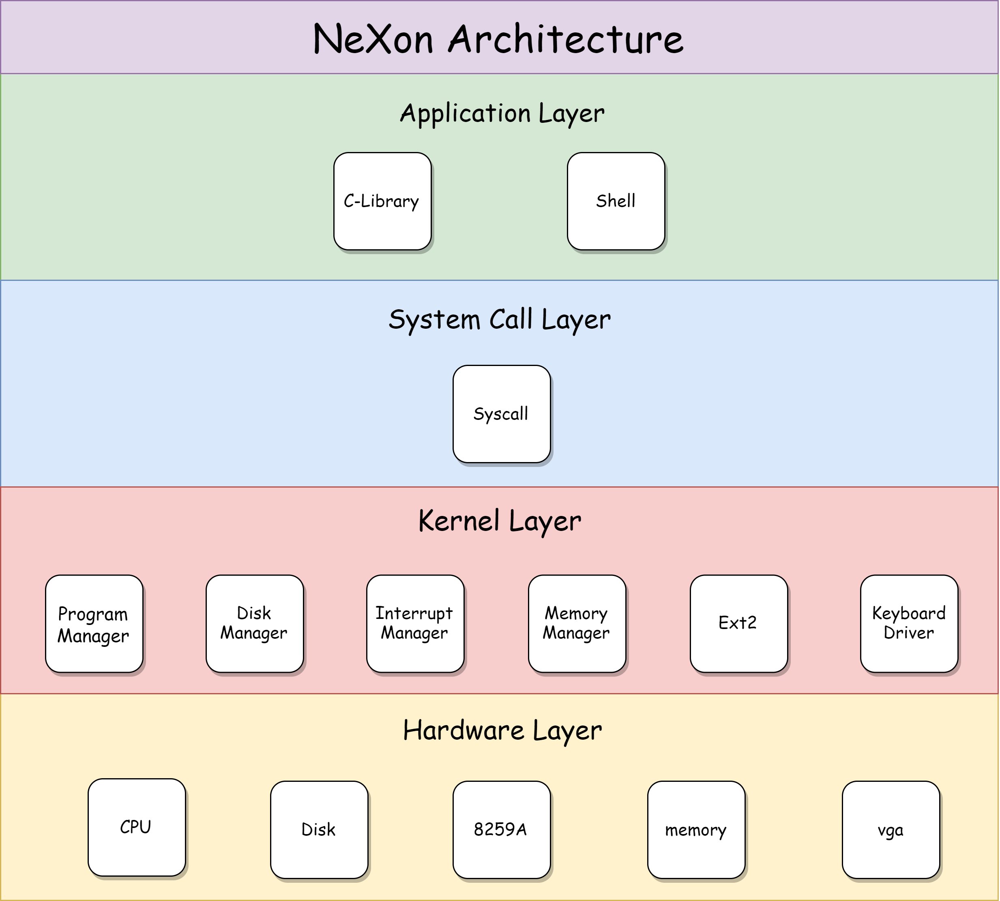
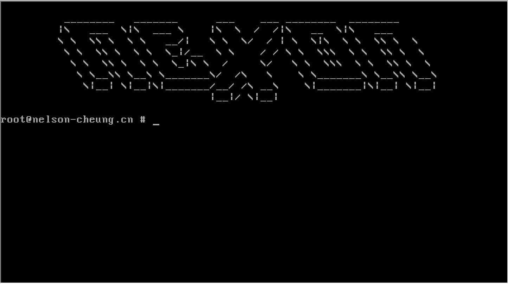
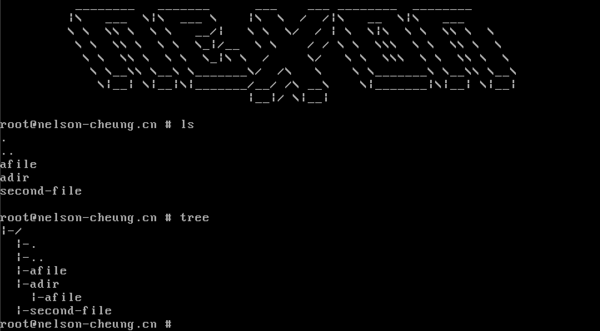
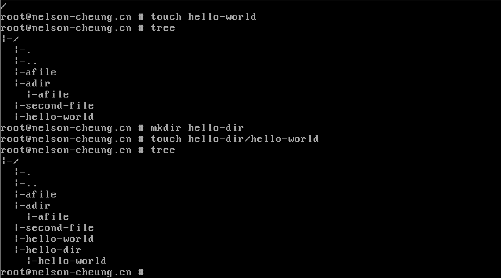
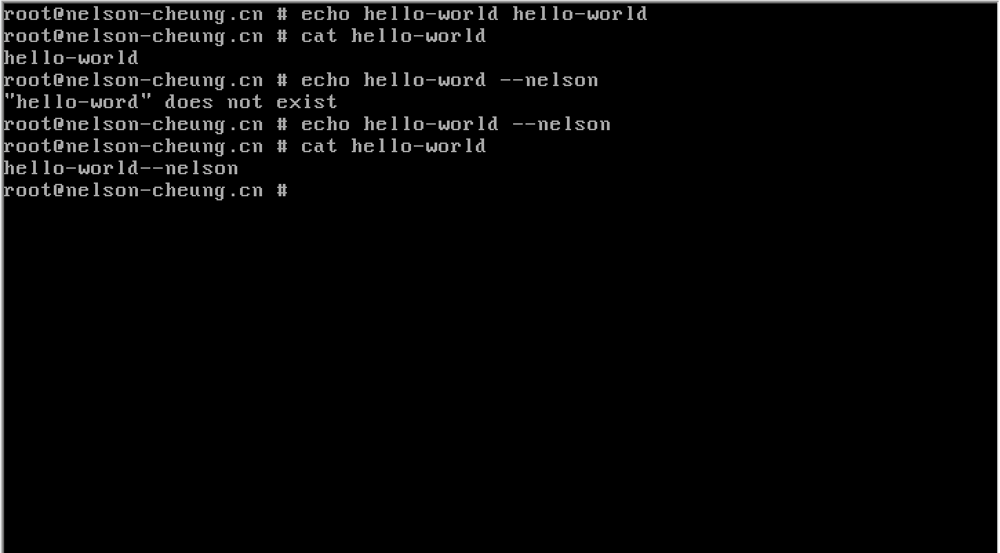
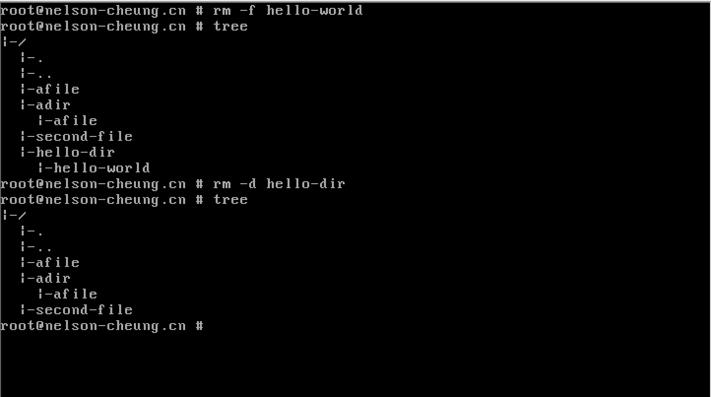
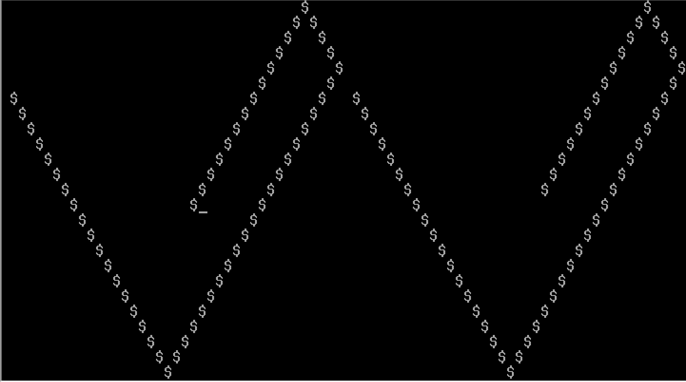
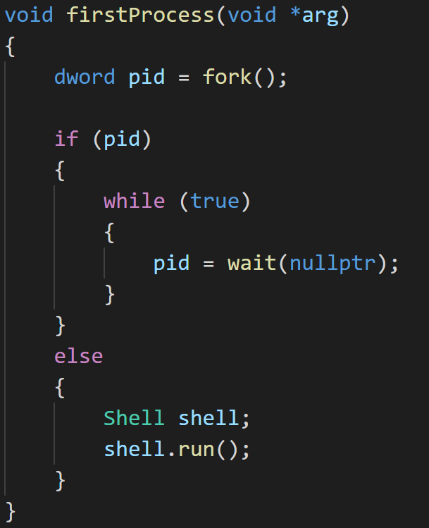
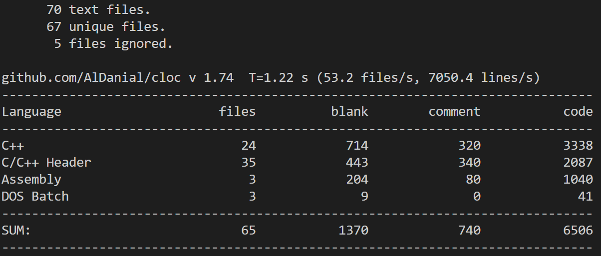

# 操作系统实验简明教程

> NeXon的意义不在于其几乎实现了现代操作系统的重要概念，而是在于我希望通过NeXon来为后续上操作系统实验课的同学提供一种简洁、优雅但全面的实现思路，从根本上帮助同学们走出操作系统实验“乱花渐欲迷人眼”的局面，从而能够使操作系统实验回归到本质——通过具体的实验理解抽象的理论。

# 作者

+ 张钧宇(Nelson Cheung)
  + NeXon的独立作者。
  + 操作系统实验简明教程的独立作者。
  + 中山大学计算机科学方向2018级学生。
  + 2019秋季操作系统课程上取得理论99，实验100的成绩(满分均为100)。

# 创新之处

+ **编程语言**。汇编语法简单，不涉及`section`等关键字和段的定义，不涉及内联汇编。尽量降低汇编代码量，尽可能使用C/C++来开发内核。
+ **内容组织**。教程详细地讲述了实验中用到的基础知识、toolchain和debug技巧。同时，课后配有相应的习题，以帮助同学们理解实验中的重点内容。
+ **教程目标**。教程的目的是培养同学们从0开始编写属于自己的操作系统内核的能力。
+ **学习收获**。通过本教程的学习后，同学们熟悉掌握操作系统核心概念，程序的编译执行过程，GCC编译工具的使用，C/C++项目的构建和管理、类Unix环境等内容。
+ **教学模式**。采用递进演变的方式来教学。每一章都有明确的实验目标，但每一章都会通过一系列递进的例子来帮助同学们达到这个最终的目标，以减少同学们学习的难度，从而帮助同学们在实验递进演变的过程中理解和消化对应的知识。
+ **自成体系**。每一章都不是孤立地存在，而是联系紧密，自成一体的。例如前面章节编写过的代码会作为例子来帮助理解后面章节的基础知识。
+ **代码简介**。截至目前，完成上卷全部功能的C++代码只有刚好2k行。

教程分为上下卷。

上卷为第1-6章，侧重于基础知识，覆盖汇编语法，实模式和保护模式，C语言从代码到程序，IO端口读写，可编程中断控制器，分页机制，TSS等，上卷的知识无法通过逻辑来推导，也就是我常说的约定俗成的。因此只有充分了解上卷部份，我们才可以顺利地完成操作系统实验。

下卷为第7-11章，侧重于模块设计，覆盖信号量，malloc/free，fork/exit/wait，文件系统和shell的实现。完成下卷所需要的知识已经全部在上卷中讲解完毕，因此下卷是在上卷的基础上完成操作系统的高级功能。

各章内容如下所示。

## 第1章 实验入门

实验环境配置、Intel汇编、nasm汇编、实模式和显存。

## 第2章 从实模式到保护模式

bootloader的实现、从实模式到保护模式、保护模式下的硬件交互。

## 第3章 硬中断

汇编和C/C++混合编程、简单IO库、硬中断编程、8259A编程、实时钟。

## 第4章 二级分页机制

二级分页机制、printf的实现。

## 第5章 内核线程

简单动态内存分配、内核线程的五状态模型实现、基于时间片轮转的多线程调度。

## 第6章 从内核态到用户态

用户进程的五状态模型的实现、系统调用的实现、软中断编程。

---

## 第7章 

信号量和锁机制的实现。

## 第8章 

动态内存分配的完善、malloc/free的实现。

## 第9章 

fork, wait, exit的实现。

## 第10章 

磁盘驱动程序的实现、简单Ext2文件系统。

## 第11章 

键盘驱动的实现、简单Shell的实现。

# 未实现

+ 源码级别的调试。
+ 虚拟内存管理。

# 起因

在操作系统实验课上，即便老师已经将操作系统的理论讲述了一遍后，到我们做实验时却又感觉无从下手。根本原因在于我们手头上没有充分的指导资料来应对老师的需求。再加上我做的是保护模式，资料就更少了。这就导致了许多同学在选择实模式和保护模式的问题上倾向了实模式。而我在开发自己的hobby OS的过程中越来越感觉到只有做保护模式才能更好的理解现代操作系统的精髓。例如，保护模式的二级分页机制在实模式中并未涉及。同时，保护模式需要自己编写所有和硬件交互的程序，即驱动程序。编写驱动程序的过程是能够加深自己对操作系统本质的理解——操作系统是管理计算机硬件与软件资源的计算机程序。于是从lab2开始，我就在设想能不能够通过自己的努力来填补这一部分的空白，即编写对应的保护模式操作系统的tutorial。而在这种想法的指导下，我在写实验报告时就想到未来可能要将自己的报告作为tutorial的蓝本。因此，我详细地将所用到的基础知识和自己的理解记录下来，以致于到lab3的时候我给助教提交了68页的实验报告。有同学会说：“年轻人你不讲卷德！”。燕雀安知鸿鹄志？于是后面在结课之后我也陆陆续续地在发展自己的hobby OS，并为之取名为NeXon(致敬Linus和Linux)。到今天，NeXon具有了二级分页机制、内核线程、用户进程、线程/进程5状态模型、进程/线程回收、并发同步机制、动态内存分配、Ext2文件系统和Shell等。此后，我基于NeXon的内容来编写一份真正意义上的tutorial，以帮助同学们能够以一种简单、优雅但全面的方式来完成操作系统实验。

# 体系结构

# 效果

NeXon的Shell效果图如下。

