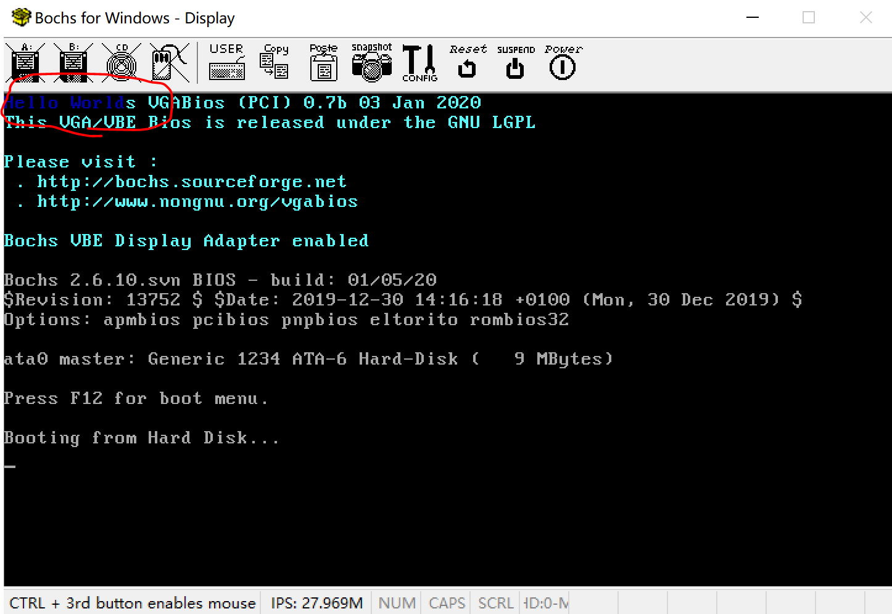
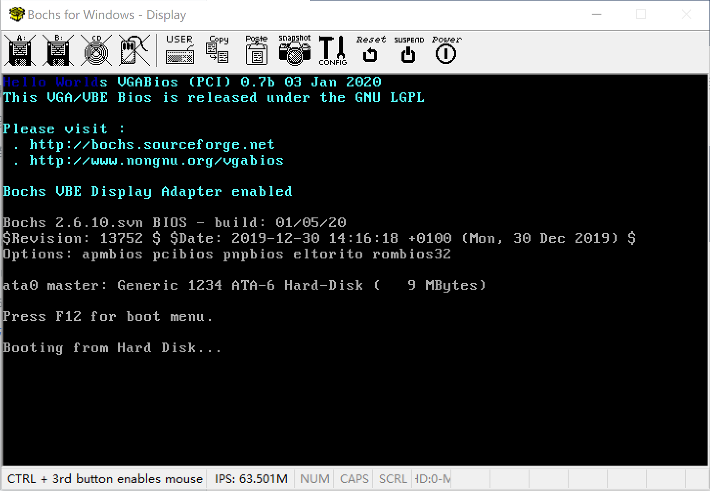
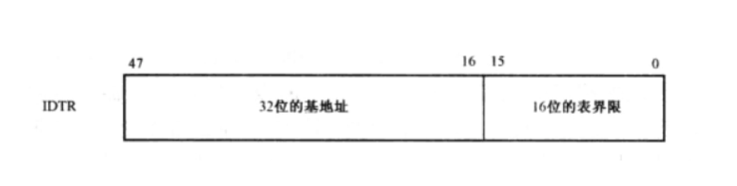
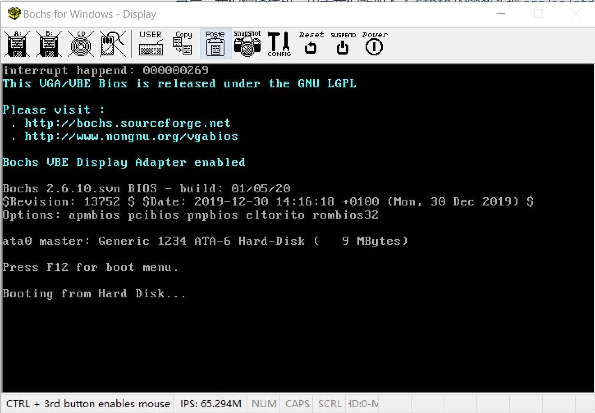
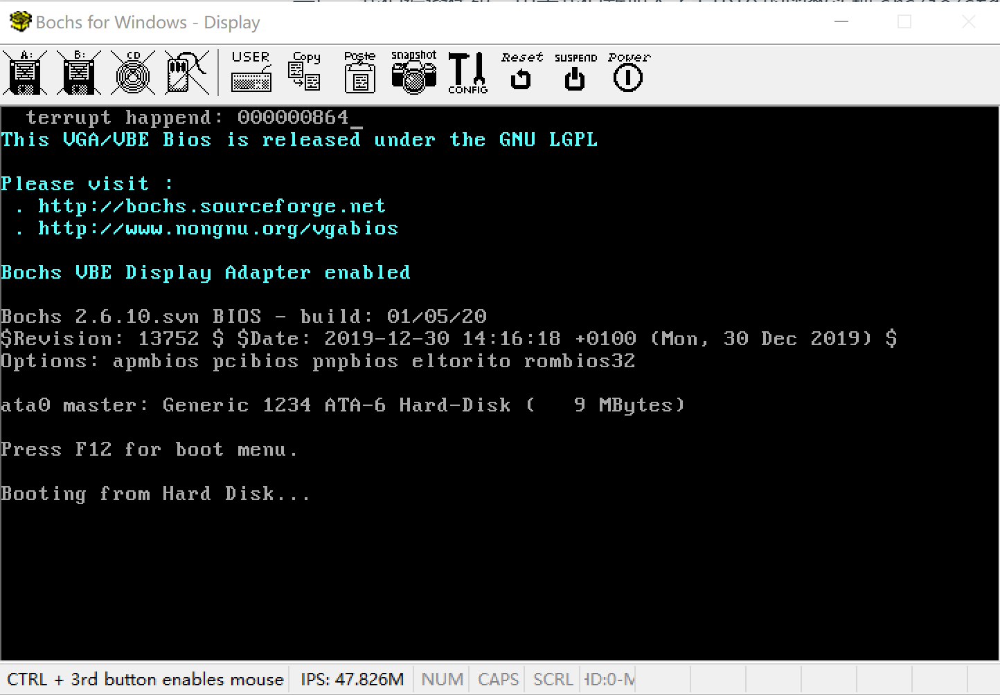

# 第三章 硬中断

> 一切的技术都在剧烈动荡，唯有思想永存。

[toc]

# 写在前面

> **这一章的内容有些多，同学们需要结合讲义的内容，仔细阅读源码并体会源码的编写思路才能将其连接成一个整体。**

在本章中，同学们会学习如下内容。

+ C代码变成C程序的过程。
+ C++项目的组织方法。
+ makefile的使用。
+ C和汇编混合编程。
+ 保护模式中断处理机制。
+ 8259A可编程中断处理部件。
+ 时钟中断的处理。

通过本章的学习，同学们将掌握使用C语言来编写内核的方法，理解保护模式的中断处理机制和处理时钟中断，为后面的二级分页机制和多线程/进程打下基础。

# 参考资料

+ [C语言-从代码到程序的过程理解](https://www.cnblogs.com/linzworld/p/13690620.html)
+ 谢煜波.PYOS，纯C论坛（纯C论坛已绝迹）
+ 《从实模式到保护模式》
+ 陆勇.中山大学.考试酷

# 统一实验环境

自本次实验开始，我们将我们环境统一迁移到类Unix环境下，即Linux，MacOS或WSL(unix也可以，当然你要找到并可用)。使用windows的同学也不用担心，我使用的也是windows系统。因此，对于使用windows的同学，我们并不需要装虚拟机，我们只需要安装wsl。

WSL全称是适用于Linux的Windows子系统（英语：Windows Subsystem for Linux，简称WSL，可以理解为awsl:joy:），是一个为在Windows 10上能够原生运行格式的兼容层。简单地说，我们借助于WSL在windows系统下使用linux的命令，如dd，然后直接处理windows下的文件。Linux和MacOS环境下的同学可以直接运行编译命令。

> 迁移到类unix环境只是简单地因为该环境下的工具比较好用，并没有什么谜之崇拜。相反，在使用体验上，我倾向于使用windows系统。而我之前写的NeXon v0.0就是全程在windows下开发，并没有使用任何类unix环境。但是，为什么在本次教程中迁移到类unix环境下了呢？因为在windows下开发需要安装i686-gcc交叉编译器等工具，这些工具比较难找，而在ubuntu下可以简单地使用apt命令安装。操作系统内核必定是一个大的C/C++工程，windows对于这些大工程的编译感觉不如在类unix环境下方便，而在类unix环境下我们可以使用make命令来编译。当然，在windows下使用bat来编译也可以，我也是这么做的，但我还是觉得不够优雅。
>
> 最重要的一点是，我在做操作系统实验的过程中，助教一直在推崇什么“使用Linux，MacOS属于环境创新，可以加分，使用windows则不加分”。可能助教想表达的意思和我上面表达的相同，但是涉及到加分就没必要啦。**在我看来，熟悉类unix环境是程序员的最基本素养，不属于环境创新！！！**因此，我向来十分反感对Linux和MacOS谜之崇拜，然后对Windows盲目鄙视的行为。于是，在操作系统实验这门课上，我至始至终都在报告中附上类似的一句话——“本实验完完全全在windows下进行，不涉及任何Linux和MacOS等环境创新项”。这也是为什么同学们在github上看到的开篇第一句话是“NeXon以助教的一句‘使用Linux和LaTeX为环境创新’为嚆矢。”(这句话改编自另外一篇我也不怎么喜欢的文章，为了避免不必要的麻烦，在此按下不表)。
>
> 上面的论述带有我个人极大的偏见，全程使用windows只是用行动在捍卫我的观点，并不是抗拒Linux等类Unix环境。而现在我是在编写一个教程，当然是要从客观事实出发看问题。类unix环境下开发操作系统无疑比单纯在windows下效率要高，这一点同学们可以在后面的实验中体会。因此，我强烈建议同学们迁移到类unix环境。

同学们可以自行挑一个自己喜欢的类Unix环境，如Ubuntu, CentOS, Deepin等Linux发行版，MacOS(使用MacOS的话最好是苹果电脑，黑苹果巨慢)，Windows下直接在应用商店安装WSL，WSL其实是Ubuntu。下面的命令均在类Unix环境下运行。

> 当然，如果不知道怎么选，建议虚拟机+ubuntu 16.04。

# 从代码到可执行文件

我们以一个例子来看C/C++从代码到可执行文件的过程。

我们先编写一个`print.h`的头文件，声明一个名为`printSomething()`的函数。

```c
#ifndef PRINT_H
#define PRINT_H

void printSomething();

#endif
```

然后，我们在`print.c`中实现这个函数。

```c
#include "print.h"
#include "stdio.h"

void printSomething() {
    printf("Hello World\n");
}
```

最后，我们在`hello.c`中使用这个函数打印并输出。

```c
#include "print.h"

int main() {
    printSomething();
}
```

接下来，我们要开始编译运行。

> 同学们可能熟悉在dev-cpp、codeblock或vscode中按F5什么的直接编译。但是，在本实验中，我们使用的都是命令行编译的方法。实际上，同学们按F5直接编译后，IDE在后台使用命令行给我们编译。同学们学习完本课程后，在后面的编程中应该会习惯于直接使用命令行编译，反而会觉得按F5直接编译的方法有些奇怪(至少我是这样的:joy:)。

我们编译的命令如下。

```shell
gcc -o hello hello.c
```

这条命令是编译`hello.c`，然后生成可执行文件`hello`。其中，`-o`指定了生成的可执行文件的名称。但是，直接运行上述命令会出现以下错误。

```shell
hello.c:(.text+0xa): undefined reference to `printSomething'
```

这是因为`hello.c`不知道函数`printSomething`的实现。而函数`printSomething`的实现在文件`print.c`中，我们需要在编译命令中加上它，如下所示。

```shell
gcc -o hello hello.c print.c
```

然后使用命令`./hello`运行，程序输出“Hello World”。

为什么单独找上面这个错误来讲呢？这是因为写操作系统内核实际上是在写一个大型的C/C++项目，例如NeXon v0.0就有73个文件。我们常常是在`.h`文件中编写函数的声明，然后在`.c`或`.cpp`文件中实现这个函数。注意，我们并不会在`.h`文件中实现函数，否则当多个文件包含相同的`.h`文件时，会出现函数重定义问题。而函数的声明和定义分开后，我们在编译时不能只编译main函数所在的文件，而要把其他的`.c`或`.cpp`文件加上去编译。而这一点常常会被忘记，以至于编译时报了一大堆找不到函数的实现的错误。

上面的命令也可以这样写。

```shell
gcc hello.c print.c -o hello
```

这样写可能会直观一点，但我熟悉原来的写法，同学们可以根据自己的需要调整。

在上面的例子中，我们是一步从代码到可执行文件的，那么其中实际上包含如下几个步骤。

+ 预处理。处理宏定义，如`#include`, `#define`, `#ifndef`等，生成预处理文件`.i`文件。
+ 编译。将`.i`文件转换成汇编代码`.s`文件。
+ 汇编：将`.s`文件转换成二进制目标代码`.o`文件。
+ 链接：将多个目标文件`.o`文件链接生成可执行文件。

> 上面的那个找不到函数`printSomething`的实现的错误实际上是在链接阶段出错。我们知道，在C/C++中，函数需要先定义然后才能使用。这里的定义指的是声明，即给出函数头即可，不需要给出函数实现。在预处理、编译和汇编阶段，我们使用的都是函数的声明，只有到了链接阶段我们才需要函数的实现。

我们下面分别来看这4个阶段。

预编译过程主要处理宏定义，如`#include`, `#define`, `#ifndef`等，并删除注释行，还会添加行号和文件名标识，以便于编译时编译器产生调试用的行号信息，及产生编译错误或警告时能够显示行号。经过预编译的`.i`文件不包含任何宏定义，因为所有的宏已经被展开，并且包含的文件也已经被插入到`.i`文件中。在上面的例子中，我们对`hello.c`进行预处理，生成`hello.i`预处理文件，命令如下。

```shell
gcc -o hello.i -E hello.c
```

生成的内容如下。

```
# 1 "hello.c"
# 1 "<built-in>"
# 1 "<command-line>"
# 31 "<command-line>"
# 1 "/usr/include/stdc-predef.h" 1 3 4
# 32 "<command-line>" 2
# 1 "hello.c"
# 1 "print.h" 1


void printSomething();
# 2 "hello.c" 2

int main() {
    printSomething();
}

```

编译是将`.i`文件转换成汇编代码`.s`文件的过程，具体的步骤主要有：词法分析 -> 语法分析 -> 语义分析及相关的优化 -> 中间代码生成 -> 目标代码生成（汇编文件.s），生成汇编代码的命令如下，`-masm=intel`是为了生成intel风格的汇编代码，否则默认AT&T风格的代码。

```shell
gcc -o hello.s -S hello.c -masm=intel
```

生成的`hello.s`内容如下。

```asm
	.file	"hello.c"
	.intel_syntax noprefix
	.text
	.globl	main
	.type	main, @function
main:
.LFB0:
	.cfi_startproc
	push	rbp
	.cfi_def_cfa_offset 16
	.cfi_offset 6, -16
	mov	rbp, rsp
	.cfi_def_cfa_register 6
	mov	eax, 0
	call	printSomething@PLT
	mov	eax, 0
	pop	rbp
	.cfi_def_cfa 7, 8
	ret
	.cfi_endproc
.LFE0:
	.size	main, .-main
	.ident	"GCC: (Ubuntu 7.5.0-3ubuntu1~18.04) 7.5.0"
	.section	.note.GNU-stack,"",@progbits

```

汇编阶段是将`.s`文件转换成二进制目标文件`.o`文件。汇编器（as）将hello.s翻译成机器语言指令，把这些指令打包成一种叫做可重定位目标程序的格式，并将结果保存在目标文件hello.o中。hello.o文件是一个二进制文件，它的字节编码是机器语言指令而不是字符。如果我们在文本编译器中打开hello.o文件，看到的将是一堆乱码，生成命令如下。

```shell
gcc -o hello.o -c hello.c
```

链接阶段就是把几个目标文件(`.o`文件)整合成一个可执行文件。上面已经提到，函数的实现可能分布在多个文件中，在链接阶段我们才需要提供函数实现的位置，然后最终生成可执行文件。链接阶段是通过链接器(ld)完成的，链接器将一些输入的目标文件加工后合成一个可执行文件。这些目标文件中往往有相互的数据、函数引用，命令如下。

```shell
gcc -o hello.o -c hello.c
gcc -o print.o -c print.c
gcc -o hello hello.o print.o
```

然后使用命令`./hello`即可执行。

> 同学们可能会感到奇怪为什么预处理、编译、汇编和链接都是使用gcc，而不是使用as、ld等，这是因为gcc全名叫GNU Compiler Collection，是一个编译工具的集合，其内部会自动调用as、ld等。我们只需简单使用gcc来完成上述过程即可。

# C/C++工程编译方法

我们看到，在编译时我们需要加上所有的`.c`文件，那么在文件数量变多，涉及到多个文件夹时，仅仅使用一条命令来编译显然是非常麻烦的。因此，我们需要新的编译工具——make。实际上，我们可以将make看成一个批处理文件，make并不提供编译工具，我们依旧使用gcc/g++来编译，make只是把这些编译命令合在了一个文件中，称为`Makefile`。

> 限于我的水平，关于Makefile的编写请大家参考网上的教程，例如[这篇](http://c.biancheng.net/makefile/)，然后在实践中加深自己的理解。

我们在编译程序的过程如下。

1. 将`.c`、`.cpp`，`.asm`编译成目录文件`.o`。
2. 使用链接器将`.o`文件合成一个文件。

因此，上面的例子的Makefile如下。

```makefile
hello: hello.o print.o
	gcc -o hello hello.o print.o

hello.o: hello.c print.h
	gcc -o hello.o -c hello.c

print.o: print.c print.h
	gcc -o print.o -c print.c

clean:
	rm hello *.i *.o *.asm
```

然后编译运行。

```shell
make
./hello
```

值得注意的是，在编译命令中指出`.h`文件后，我们就不用在宏定义`#include`中指出`.h`文件的地址。例如，假设`print.h`放在目录`src/print`下，`hello.c`放在`src`下。那么按照我们的理解，`hello.c`中应该使用`#include "print/print.h"`，但是我们在编译命令中指出`.h`文件后，我们在`hello.c`中使用`#include "print.h"`即可。这一点同学们会随着文件数量变多后逐步理解。

> 虽然我推荐同学们使用makefile编译，但是同学们也可以不使用。

# C/C++和汇编混合编程

## 混合编程的语法

C/C++和汇编混合编程指的是我们可以在C/C++代码中使用汇编代码的函数、在汇编代码中使用C/C++中的函数。混合编程是必要的，例如在bootloader初始化后，我们需要跳转到C/C++编写的函数中执行；又如我们需要在C/C++中调用使用汇编代码读取硬盘的函数。

> 混合编程的另外一个原因是我并不打算使用内联汇编。内联汇编使用的是AT&T风格的语法，有自己的一套规则。注意到任何使用到内联汇编的情况都可以用一个汇编函数来代替，为了简便起见，我会在C/C++中使用汇编函数来代替内联汇编。（汇编函数指的是在我们使用汇编代码实现的函数）

那么这是怎么做到的呢？回顾上面的知识点我们知道，C/C++首先会被编译成汇编代码，然后再汇编形成目录文件`.o`文件，最后由多个目录文件链接成一个文件。无论是汇编代码还是C/C++代码，它们都有一个相同的终点——目录文件。因此，当我们需要在汇编代码中使用C/C++函数时，我们只需要在汇编代码中声明这个函数来自于外部。我们并不需要关心函数是否被实现，因为我们是在链接阶段才会用到函数的实现。同理，当我们需要在C/C++使用汇编代码的函数时，我们也只需要在C/C++中声明用到的函数来自于外部即可。

声明的规则如下。当我们需要在汇编代码中使用C的函数`functionFromC`时，我们需要在汇编代码中声明这个函数来自于外部。

```asm
extern functionFromC
```

声明后便可直接使用，例如。

```asm
call functionFromC
```

但是，如果我们需要在汇编代码中使用来自C++的函数`functionFromCpp`，我们需要现在C++代码的函数声明前加上`extern "C"`。因为C++支持函数重载，为了区别同名的重载函数，C++在编译时会进行名字修饰。也就是说，`functionFromCpp`编译后的标号不再是`functionFromCpp`，而是要带上额外的信息。而C代码编译后的标号还是原来的函数名。因此，`extern "C"`目的是告诉编译器按C代码的规则编译，不进行名字修饰。例如，我们首先需要在C++代码中声明如下。

```cpp
extern "C" functionFromCpp();
```

在汇编代码中声明这个函数即可。

```asm
extern functionFromCpp
```

如果不加`extern "C"`，那么我们在汇编代码中声明的标号就不是`functionFromCpp`，而是`functionFromCpp`经过名字修饰后的标号，这将会变得非常麻烦。

在C/C++调用汇编函数之前，我们先需要在汇编函数中将函数声明为`global`。例如我们需要调用汇编函数`function_from_asm`，那么我们首先需要在汇编函数中声明为`global`。

```asm
global function_from_asm
```

否则在链接阶段会找不到函数的实现。

然后我们在C/C++中将其声明来自外部即可，如下所示。

```c
extern void function_from_asm();
```

在C++中需要声明为`extern "C"`，如下所示。

```cpp
extern "C" void function_from_asm();
```

在很多情况下，我们调用的函数是带有返回值和参数的。在前面的“改造MBR”的内容中，我们提到了C/C++函数调用规则，这里我们再重温一下，如下所示。

+ 如果函数有参数，那么参数从右向左依次入栈。
+ 如果函数有返回值，返回值放在eax中。
+ 放置于栈的参数一般使用ebp来获取

我们以一个例子来说明。我们有两个函数，一个是汇编函数`function_from_asm`，一个是C函数`functionFromC`，并且两个函数在C代码中声明如下。

```asm
extern int function_from_asm(int arg1, int arg2);
int functionFromC(int arg1, int arg2);
```

当我们需要在汇编代码中调用函数`functionFromC`，调用的形式是`functionFromC(1,2)`，此时的汇编代码如下。

```asm
push 2         ; arg2
push 1         ; arg1
call functionFromC 
add esp, 8      ; 清除栈上的参数
```

call指令返回后，函数的返回值被放在了eax中。

当我们需要在C代码中调用函数`function_from_asm`时，使用如下语句即可。

```c
int ret = function_from_asm(1, 2);
```

函数调用后，参数2，1，返回值被依次放在栈上，如下所示。

 

此时，我们实现的汇编函数`function_from_asm`必须要遵循C/C++的函数调用规则才可以被正常调用。一个遵循了C/C++的函数调用规则的汇编函数如下所示。

```asm
function_from_asm:
	push ebp
	mov ebp, esp
	
	; 下面通过ebp引用函数参数
	; [ebp + 4 * 0]是之前压入的ebp值
	; [ebp + 4 * 1]是返回地址
	; [ebp + 4 * 2]是arg1
	; [ebp + 4 * 3]是arg2
	; 返回值需要放在eax中
	
	... 
	
	pop ebp
	ret
	
```

> 汇编函数并没有函数参数的概念，因此汇编函数也被称为过程，不过是一段指令序列而已。函数参数的概念是我们在C/C++函数调用规则中人为给出规定的，汇编函数并不知情。这一点请同学们仔细体会。

实际上，C/C++函数被编译成汇编代码后也是按照`function_from_asm`给出的格式来实现的，同学们可以在bochs中自行反汇编查看。

## Assignment 1 混合编程

我们已经学习了混合编程的知识和程序编译的过程，现在通过一个例子来加深我们的印象。

> Assignment 1：按如下步骤完成assignment 1。
>
> 1. 编写汇编函数`asm_hello_world`输出“Hello World”，放到单独的文件`asm_utils.asm`(一般来说，工具类函数放置的文件多以“utils”来命名)。
> 2. 编写C函数`c_print_something`调用汇编函数`asm_hello_world`，放到单独的文件`setup.c`中。
> 3. 在bootloader进入保护模式后，调用C函数`c_print_something`。

我们首先编写汇编函数`asm_hello_world`，放置到`asm_utils.asm`文件中。

```asm
[bits 32]

global asm_hello_world

asm_hello_world:
    push eax
    xor eax, eax

    mov ah, 0x01 ;蓝色
    mov al, 'H'
    mov [gs:2 * 0], ax

    mov al, 'e'
    mov [gs:2 * 1], ax

    mov al, 'l'
    mov [gs:2 * 2], ax

    mov al, 'l'
    mov [gs:2 * 3], ax

    mov al, 'o'
    mov [gs:2 * 4], ax

    mov al, ' '
    mov [gs:2 * 5], ax

    mov al, 'W'
    mov [gs:2 * 6], ax

    mov al, 'o'
    mov [gs:2 * 7], ax

    mov al, 'r'
    mov [gs:2 * 8], ax

    mov al, 'l'
    mov [gs:2 * 9], ax

    mov al, 'd'
    mov [gs:2 * 10], ax

    pop eax
    ret
```

然后我们编写C函数`c_print_something`，放置到文件`setup.c`中，如下所示。

```c
extern void asm_hello_world();

void c_print_something() {
    asm_hello_world();
}
```

我们在bootloader进入保护模式后，调用`c_print_something`，如下所示。

```asm
%include "boot.inc"

extern c_print_something

; ... 
; 进入保护模式

;16位的描述符选择子：32位偏移
;清流水线并串行化处理器
[bits 32]           
protect_mode_begin:                              

mov eax, DATA_SELECTOR                     ;加载数据段(0..4GB)选择子
mov ds, eax
mov es, eax
mov eax, STACK_SELECTOR
mov ss, eax
mov eax, VIDEO_SELECTOR
mov gs, eax

call c_print_something

jmp $ ; 死循环

pgdt dw 0
     dd GDT_START_ADDRESS
```

我们首先将这3个文件统一编译成目录文件`.o`文件，然后将这些`.o`文件链接成一个二进制文件。汇编代码的编译命令分别如下。

```shell
nasm -o asm_utils.o -f elf32 asm_utils.asm
nasm -o bootloader.o -f elf32 bootloader.asm
```

其中，`-f elf32`指定了编译生成的文件格式是`elf`文件格式，`elf`文件格式也就是unix下的`.o`文件，windows则不是。然后我们编译C代码，命令如下。

```shell
gcc -o setup.o -c -O0 -Wall -march=i386 -m32 -nostdlib -fno-builtin -ffreestanding -fno-pic setup.c
```

上面的参数有点多，我们逐一来看。

+ `-O0`告诉编译器不开启编译优化。
+ `-Wall`告诉编译器显示所有编译器警告信息
+ `-march=i386`告诉编译器生成i386处理器下的`.o`文件格式。
+ `-m32`告诉编译器生成32位的二进制文件。
+ `-nostdlib -fno-builtin -ffreestanding -fno-pic`是告诉编译器不要包含C的任何标准库。

> 在程序员界，有许多关于大神Jeff Dean的调侃趣闻，其中一部分就是关于程序编译的。同学们熟悉了程序的编译过程后便能理解下面趣闻的幽默之处。
>
> + Compilers don't warn Jeff Dean. Jeff Dean warns compilers.
> + Jeff Dean builds his code before committing it, but only to check for compiler and linker bugs.
> + `gcc -O4` emails your code to Jeff Dean for a rewrite.

**特别注意，我们是在写操作系统内核，以往的C标准库内容如printf我们都不可以使用。**因为这些内容是依赖于操作系统的，所以在后面的实验中，我们需要自己去实现printf等标准库内容。

然后我们开始链接，我们使用`ld`来将多个`.o`文件链接成一个二进制文件。

```shell
ld -o bootloader.bin -melf_i386 -N bootloader.o asm_utils.o setup.o -Ttext 0x0 --oformat binary
```

这里面同样涉及很多参数，我们逐一来看。

+ `-m`参数指定模拟器为i386。
+ `-N`参数告诉链接器不要进行页对齐。
+ `-Ttext`指定标号的起始地址。
+ `--oformat`指定输出文件格式。

注意，输出的二进制文件的机器指令顺序和链接时给出的文件顺序相同。也就是说，如果我们按如下命令链接

```shell
ld -o bootloader.bin -melf_i386 -N setup.o bootloader.o asm_utils.o -Ttext 0x0 --oformat binary
```

那么`bootloader.bin`的第一条指令是`setup.o`的第一条指令，这样就会导致错误。链接时会出现warning信息。

```shell
ld: warning: cannot find entry symbol _start; defaulting to 0000000000000000
```

这是因为ld默认程序进入点为`_start`标号，而我们没有这个标号，所以ld指定`bootloader.bin`中的地址0x0是起始地址。当然，如果你有强迫症，你也可以在程序起始代码处加上`_start`标号。不加也没有问题，因为不是error。

> 悬崖边挂了块写着warning的牌子，结果只有程序员掉下去了。

链接后我们使用dd命令将`bootloader.bin`写入bochs使用的硬盘即可，如下所示。

```shell
dd if=bootloader.bin of=hd.img bs=512 count=5 seek=1 conv=notrunc
```

启动后的效果如下。



同学们学了makefile，我们应该学习如何使用make来编译程序。

> 限于作者的水平，这里只能不加说明地给出makefile:sweat_smile:。

```makefile
ASM_COMPILER = nasm
C_COMPLIER = gcc
C_COMPLIER_FLAGS = -O0 -Wall -march=i386 -m32 -nostdlib -fno-builtin -ffreestanding -fno-pic
LINKER = ld

hd.img : mbr.bin bootloader.bin
	dd if=mbr.bin of=hd.img bs=512 count=1 seek=0 conv=notrunc
	dd if=bootloader.bin of=hd.img bs=512 count=5 seek=1 conv=notrunc

mbr.bin : mbr.asm
	$(ASM_COMPILER) -o mbr.bin -f bin mbr.asm

bootloader.bin : bootloader.o asm_utils.o setup.o
	$(LINKER) -o bootloader.bin -melf_i386 -N bootloader.o asm_utils.o setup.o -Ttext 0x0 --oformat binary

asm_utils.o : asm_utils.asm
	$(ASM_COMPILER) -o asm_utils.o -f elf32 asm_utils.asm

bootloader.o : bootloader.asm
	$(ASM_COMPILER) -o bootloader.o -f elf32 bootloader.asm

setup.o : setup.c
	$(C_COMPLIER) -o setup.o $(C_COMPLIER_FLAGS) -c setup.c

clean:
	rm *.o

```

然后使用命令`make`或`make hd.img`即可编译，使用`make clean`清除所有生成的`.o`文件。

## Assignment 2 内核的加载

我们在bootloader中只负责完成进入包含模式的内容，然后加载操作系统内核到内存中，最后跳转到操作系统内核的起始地址，接下来的工作就由操作系统内核接管了。从代码层面来看，bootloader我们是使用汇编代码来实现的，可能同学们刚开始还感觉比较陌生。但是接下来的内核部份我们可以使用C/C++来完成绝大部分的内容，汇编代码只是为我们提供汇编指令的封装，目的是不使用内联汇编。可以说，内核的加载是使用汇编代码和使用C/C++代码的分界点。因此，同学们要完成的工作如下。

> Assignment 2: 在bootloader中加载操作系统内核到地址0x20000，然后跳转到0x20000。内核接管控制权后，输出“Hello World”(代码放置在文件夹`assignment-2`下)

在此之前，我们要转变下我们的工作目录环境。我已经讲过，我们的操作系统实验就是一个C/C++项目，和同学们已经司空见惯的什么“学生信息管理系统”项目是一样的。既然是C/C++项目，我们可以使用C/C++项目管理的办法应对，如下所示。

以接下来的操作系统代码为例，假设项目的放置的文件夹是`project`。那么在`project`文件夹下会有`build`，`include`，`run`，`src`等，各个子文件夹的含义如下。

+ `project/build`。存放makefile，make之后生成的中间文件如`.o`，`.bin`等会放置在这里，目的是防止这些文件混在代码文件中。
+ `project/include`。存放`.h`等函数定义和常量定义的头文件。
+ `project/run`。存放bochs配置文件，硬盘映像`.img`文件。
+ `project/src`。存放`.c`，`.cpp`等函数实现的文件。

例如`assignment-2`的文件目录如下。

```
.
├── README.md      
├── build
│   └── makefile   
├── include        
│   ├── asm_utils.h
│   ├── boot.inc   
│   ├── os_type.h
│   └── setup.h
├── run
│   ├── bochsrc.bxrc
│   └── hd.img
└── src
    ├── boot
    │   ├── bootloader.asm
    │   ├── entry.asm
    │   └── mbr.asm
    ├── kernel
    │   └── setup.cpp
    └── utils
        └── asm_utils.asm
```

看到这里，同学们可能会有疑问——`.h`和`.cpp`并不是放在同一目录下，那么我们是不是要在`.cpp`文件里写出`.h`文件的地址呢？其实大可不必，我们只要在编译指令中指定头文件的目录即可，编译器会去自己寻找。假设`project/src/hello.cpp`要引用头文件`project/include/hello.h`，按照我们学过的知识，我们需要在`hello.cpp`这样写

```cpp
#include "../include/hello.h"
```

但这样写不太美观，而且当我们移动了`hello.h`后我们需要修改代码。此时我们可以只在`hello.cpp`中按如下写法

```cpp
#include "hello.h"
```

然后再编译指令中使用`-I`参数指明头文件的位置即可，如下所示，假设我们是在文件夹`project/build`下执行这个命令。

```shell
g++ -o hello -I../include ../src/hello.cpp
```

此时，在我们编译的时候，makefile的巨大作用便体现出来了。makefile可以自动帮我们找到`.c`，`.cpp`文件，然后编译生成`.o`文件。然后我们又可以使用makefile找到所有生成的`.o`文件，使用`ld`链接生成二进制文件。这样做的好处是当我们新增一个`.c`或`.cpp`文件后，我们几乎不需要修改makefile，大大简化了编译过程。`assignment-2`的makefile如下。

```makefile
# 首先执行 make
# 然后执行 make build

ASM_COMPILER = nasm
C_COMPLIER = gcc
CXX_COMPLIER = g++
CXX_COMPLIER_FLAGS = -O0 -Wall -march=i386 -m32 -nostdlib -fno-builtin -ffreestanding -fno-pic
LINKER = ld

SRCDIR = ../src
RUNDIR = ../run
BUILDDIR = build
INCLUDE_PATH = ../include

CXX_SOURCE += $(wildcard $(SRCDIR)/kernel/*.cpp)
OBJ = $(wildcard *.o)

complie : $(OBJ)
	@$(ASM_COMPILER) -o entry.obj -f elf32 $(SRCDIR)/boot/entry.asm
	@$(CXX_COMPLIER) $(CXX_COMPLIER_FLAGS) -I$(INCLUDE_PATH) -c $(CXX_SOURCE)
	@$(ASM_COMPILER) -o asm_utils.o -f elf32 $(SRCDIR)/utils/asm_utils.asm

build : mbr.bin bootloader.bin kernel.bin
	dd if=mbr.bin of=$(RUNDIR)/hd.img bs=512 count=1 seek=0 conv=notrunc
	dd if=bootloader.bin of=$(RUNDIR)/hd.img bs=512 count=5 seek=1 conv=notrunc
	dd if=kernel.bin of=$(RUNDIR)/hd.img bs=512 count=145 seek=6 conv=notrunc
	@rm -f $(RUNDIR)/*.lock
# nasm的include path有一个尾随/
mbr.bin : $(SRCDIR)/boot/mbr.asm
	@$(ASM_COMPILER) -o mbr.bin -f bin -I$(INCLUDE_PATH)/ $(SRCDIR)/boot/mbr.asm

bootloader.bin : $(SRCDIR)/boot/bootloader.asm 
	@$(ASM_COMPILER) -o bootloader.bin -f bin -I$(INCLUDE_PATH)/ $(SRCDIR)/boot/bootloader.asm

kernel.bin : $(OBJ)
	@$(LINKER) -o kernel.bin -melf_i386 -N entry.obj $(OBJ) -Ttext 0x00020000 --oformat binary

clean:
	@rm -f *.o* *.bin 
```

然后使用如下命令即可编译。

```shell
make complie
make build
```

> 上面讲的工程方法初次理解起来比较抽象，我写操作系统时并没有学会，而是在为同学们编写教程时逐渐学会的，也就是大三上结束才学会的。特别是makefile中的内容，限于作者的水平，同学们需要自学后理解其中的内容:sweat_smile:。但我们后面的项目目录结构皆是如此，同学们后面会变得熟能生巧。
>
> 当然，同学们如果不是用makefile和上面的项目管理方法，而是把全部的文件堆在一起，使用g++/gcc编译也是可以的。​

下面我们约定内核的大小是`145`个扇区，起始地址是`0x20000`，内核存放在硬盘的起始位置是第6个扇区。bootloader在进入保护模式后，从硬盘的第6个扇区中加载145个扇区到内存起始地址`0x20000`处，然后跳转执行。

```assembly
%include "boot.inc"
[bits 16]
;空描述符
mov dword [GDT_START_ADDRESS+0x00],0x00
mov dword [GDT_START_ADDRESS+0x04],0x00  

;创建描述符，这是一个数据段，对应0~4GB的线性地址空间
mov dword [GDT_START_ADDRESS+0x08],0x0000ffff    ; 基地址为0，段界限为0xFFFFF
mov dword [GDT_START_ADDRESS+0x0c],0x00cf9200    ; 粒度为4KB，存储器段描述符 

;建立保护模式下的堆栈段描述符      
mov dword [GDT_START_ADDRESS+0x10],0x00000000    ; 基地址为0x00000000，界限0x0 
mov dword [GDT_START_ADDRESS+0x14],0x00409600    ; 粒度为1个字节

;建立保护模式下的显存描述符   
mov dword [GDT_START_ADDRESS+0x18],0x80007fff    ; 基地址为0x000B8000，界限0x07FFF 
mov dword [GDT_START_ADDRESS+0x1c],0x0040920b    ; 粒度为字节

;创建保护模式下平坦模式代码段描述符
mov dword [GDT_START_ADDRESS+0x20],0x0000ffff    ; 基地址为0，段界限为0xFFFFF
mov dword [GDT_START_ADDRESS+0x24],0x00cf9800    ; 粒度为4kb，代码段描述符 

;初始化描述符表寄存器GDTR
mov word [pgdt + LOADER_START_ADDRESS], 39      ;描述符表的界限   
lgdt [pgdt + LOADER_START_ADDRESS]
      
in al,0x92                         ;南桥芯片内的端口 
or al,0000_0010B
out 0x92,al                        ;打开A20

cli                                ;中断机制尚未工作
mov eax,cr0
or eax,1
mov cr0,eax                        ;设置PE位
      
;以下进入保护模式
jmp dword CODE_SELECTOR:protect_mode_begin + LOADER_START_ADDRESS   

;16位的描述符选择子：32位偏移
;清流水线并串行化处理器
[bits 32]     
protect_mode_begin:                              

mov eax, DATA_SELECTOR                     ;加载数据段(0..4GB)选择子
mov ds, eax
mov es, eax
mov eax, STACK_SELECTOR
mov ss, eax
mov eax, VIDEO_SELECTOR
mov gs, eax

mov eax, KERNEL_START_SECTOR
mov ebx, KERNEL_START_ADDRESS
mov ecx, KERNEL_SECTOR_COUNT

load_kernel: 
    push eax
    push ebx
    call asm_read_hard_disk  ; 读取硬盘
    add esp, 8
    inc eax
    add ebx, 512
    loop load_kernel

jmp dword CODE_SELECTOR:KERNEL_START_ADDRESS       ; 跳转到kernel

jmp $ ; 死循环

; asm_read_hard_disk(memory,block)
; 加载逻辑扇区号为block的扇区到内存地址memory

asm_read_hard_disk:                           
    push ebp
    mov ebp, esp

    push eax
    push ebx
    push ecx
    push edx

    mov eax, [ebp + 4 * 3] ; 逻辑扇区低16位

    mov edx, 0x1f3
    out dx, al    ; LBA地址7~0

    inc edx        ; 0x1f4
    mov al, ah
    out dx, al    ; LBA地址15~8

    xor eax, eax
    inc edx        ; 0x1f5
    out dx, al    ; LBA地址23~16 = 0

    inc edx        ; 0x1f6
    mov al, ah
    and al, 0x0f
    or al, 0xe0   ; LBA地址27~24 = 0
    out dx, al

    mov edx, 0x1f2
    mov al, 1
    out dx, al   ; 读取1个扇区

    mov edx, 0x1f7    ; 0x1f7
    mov al, 0x20     ;读命令
    out dx,al

    ; 等待处理其他操作
  .waits:
    in al, dx        ; dx = 0x1f7
    and al,0x88
    cmp al,0x08
    jnz .waits                         
    

    ; 读取512字节到地址ds:bx
    mov ebx, [ebp + 4 * 2]
    mov ecx, 256   ; 每次读取一个字，2个字节，因此读取256次即可          
    mov edx, 0x1f0
  .readw:
    in ax, dx
    mov [ebx], eax
    add ebx, 2
    loop .readw
      
    pop edx
    pop ecx
    pop ebx
    pop eax
    pop ebp

    ret
  
pgdt dw 0
     dd GDT_START_ADDRESS
```

本来我们是不可以直接指定内核文件的大小的，而是需要从内核文件中读出内核的大小，但是我们需要定义特定的二进制文件格式，比如在文件最开头写出内核的大小，但这会大大增大工作量。为了简便起见，我这里直接指定内核的总扇区数。

回忆以下我们是如何生成内核的二进制文件的。我们是先把`.c`，`.cpp`，`.asm`文件编译成目标文件`.o`文件，然后使用`ld`将其链接起来。由于这里我们指定了内核起始地址是`0x20000`，因此我们需要在`ld`的`-Ttext`参数中给出内核起始地址，也就是`-Ttext 0x00020000`。我们在makefile中会自动寻找所有的`.o`文件，然后使用`ld`链接起来。但是，这样自动寻找和链接后，二进制文件的起始地址存放的并不一定是我们希望的内核进入地址。为了保险起见，我们需要将内核进入点的代码放在`ld`的所有`.o`文件之首，这样生成的二进制文件中的起始地址必定是内核进入点。

因此，我们先在`src/boot/entry.asm`下定义内核进入点。

```asm
; 不加会出现 ld: warning: cannot find entry symbol _start;
global _start
extern setup_kernel
_start:
    jmp setup_kernel
```

然后我们使用`nasm`生成对应的`.o`文件，命名为`entry.obj`，放在`ld`链接的`.o`文件之首。这样，当bootloader跳转到`0x20000`后，`0x20000`的指令就是内核进入点`_start`。在`jmp`指令执行后，我们便跳转到使用C++编写的函数`setup_kernel`。此后，我们便可以使用C++来写内核了。

`setup_kernel`的定义在文件`src/kernel/setup.cpp`中，内容如下。

```cpp
#include "asm_utils.h"

extern "C" void setup_kernel()
{
    asm_hello_world();
    while(1) {

    }
}
```

为了方便汇编代码的管理，我们将汇编函数放置在`src/utils/asm_utils.h`下，如下所示。

```asm
[bits 32]

global asm_hello_world

asm_hello_world:
    push eax
    xor eax, eax

    mov ah, 0x01 ;蓝色
    mov al, 'H'
    mov [gs:2 * 0], ax

    mov al, 'e'
    mov [gs:2 * 1], ax

    mov al, 'l'
    mov [gs:2 * 2], ax

    mov al, 'l'
    mov [gs:2 * 3], ax

    mov al, 'o'
    mov [gs:2 * 4], ax

    mov al, ' '
    mov [gs:2 * 5], ax

    mov al, 'W'
    mov [gs:2 * 6], ax

    mov al, 'o'
    mov [gs:2 * 7], ax

    mov al, 'r'
    mov [gs:2 * 8], ax

    mov al, 'l'
    mov [gs:2 * 9], ax

    mov al, 'd'
    mov [gs:2 * 10], ax

    pop eax
    ret
```

然后我们统一在文件`include/asm_utils.h`中声明所有的汇编函数，这样我们就不用单独地使用`extern`来声明了，只需要`#include "asm_utils.h"`即可，如下所示。

```cpp
#ifndef ASM_UTILS_H
#define ASM_UTILS_H

extern "C" void asm_hello_world();

#endif
```

重要内容大概是这些，同学们如果还有不明白的可以自行翻阅`assignment-2`下的代码。然后我们使用如下指令编译。

```shell
make complie
make build
```

使用bochs加载对应的硬盘文件即可，效果如下。



# 保护模式下的中断

> 注意到本章的内容是硬中断，也就是说，接下来的内容才是主菜，前面的内容都是开胃菜:sweat_smile:。

## 保护模式中断概述

> 在操作系统学习过程中，我们会遇到中断、异常和陷阱三个概念。但是在接下来的叙述中，我统一将其归结到中断中，希望读者在理论学习过程中不要将这三者混淆。

计算机除了CPU之外还有许多外围设备，如键盘、鼠标和硬盘等。但是，相比于CPU 的运行速度来说，这些外围设备的运行速度要慢得多。如果CPU时刻需要关注这些外围设备的运行或者轮询等待这些设备的请求到来，就会大大增加计算机整体的运行延迟。所以，计算机的做法是，CPU无需关注外围设备的运行，当外围设备产生请求时，外设通过一种信号告诉CPU应该暂停当前状态，转向处理外围设备的请求，请求处理完成后再恢复到原先暂停的状态继续运行。这种处理方法便称为中断。因此，我们才有“操作系统是中断驱动的”这种说法。

中断有两种类型，外部中断和内部中断。外部中断由硬件产生，因此又被称为硬中断。内部中断通过在程序中使用`int`指令调用，因此又被称为软中断。为了处理中断，OS需要预先建立中断和中断向量号的对应关系。这里，中断向量号是用来标识不同中断程序的序号。例如，我们可以使用`int 10h`来调用10h中断，10h就是中断向量号。

外部中断有屏蔽中断和不可屏蔽中断两种类型，屏蔽中断由INTR引脚产生，通过8259A芯片建立。不可屏蔽中断通过NMI引脚产生，例如除零错误。

内部中断就是程序中手动调用的中断，如`int 10h`，此处调用的10h中断就被称为内部中断。在实模式下，BIOS中集成了一些中断程序，在BIOS加电启动后这些中断程序便被放置在内存中。当我们需要调用某个中断时，我们直接在`int`指令中给出中断向量号即可。但是，BIOS内置的中断程序是16位的。所以，在保护模式下这些代码便不再适用。不仅如此，保护模式重新对中断向量号进行编号，也就是说，即使是相同的中断向量号，其在实模式和保护模式中的意义不再相同。保护模式下的中断向量号约定如下所示。

| 向量号 | 助记符 | 说明                         | 类型      | 错误号  | 产生源                                                |
| ------ | ------ | ---------------------------- | --------- | ------- | ----------------------------------------------------- |
| 0      | #DE    | 除出错                       | 故障      | 无      | DIV或IDIV指令                                         |
| 1      | #DB    | 调试                         | 故障/陷阱 | 无      | 任何代码或数据引用，或是INT 1指令                     |
| 2      | --     | NMI中断                      | 中断      | 无      | 非屏蔽外部中断                                        |
| 3      | #BP    | 断点                         | 陷阱      | 无      | INT 3指令                                             |
| 4      | #OF    | 溢出                         | 陷阱      | 无      | INTO指令                                              |
| 5      | #BR    | 边界范围超出                 | 故障      | 无      | BOUND指令                                             |
| 6      | #UD    | 无效操作码（未定义操作码）   | 故障      | 无      | UD2指令或保留的操作码。（Pentium Pro中加入的新指令）  |
| 7      | #NM    | 设备不存在（无数学协处理器） | 故障      | 无      | 浮点或WAIT/FWAIT指令                                  |
| 8      | #DF    | 双重错误                     | 异常终止  | 有（0） | 任何可产生异常、NMI或INTR的指令                       |
| 9      | --     | 协处理器段超越（保留）       | 故障      | 无      | 浮点指令（386以后的CPU不产生该异常）                  |
| 10     | #TS    | 无效的任务状态段TSS          | 故障      | 有      | 任务交换或访问TSS                                     |
| 11     | #NP    | 段不存在                     | 故障      | 有      | 加载段寄存器或访问系统段                              |
| 12     | #SS    | 堆栈段错误                   | 故障      | 有      | 堆栈操作和SS寄存器加载                                |
| 13     | #GP    | 一般保护错误                 | 故障      | 有      | 任何内存引用和其他保护检查                            |
| 14     | #PF    | 页面错误                     | 故障      | 有      | 任何内存引用                                          |
| 15     | --     | （Intel保留，请勿使用）      |           | 无      |                                                       |
| 16     | #MF    | x87 FPU浮点错误（数学错误）  | 故障      | 无      | x87 FPU浮点或WAIT/FWAIT指令                           |
| 17     | #AC    | 对起检查                     | 故障      | 有（0） | 对内存中任何数据的引用                                |
| 18     | #MC    | 机器检查                     | 异常终止  | 无      | 错误码（若有）和产生源与CPU类型有关（奔腾处理器引进） |
| 19     | #XF    | SIMD浮点异常                 | 故障      | 无      | SSE和SSE2浮点指令（PIII处理器引进）                   |
| 20-31  | --     | （Intel保留，请勿使用）      |           |         |                                                       |
| 32-255 | --     | 用户定义（非保留）中断       | 中断      |         | 外部中断或者INT n指令                                 |

因此，在保护模式下，我们需要自己去实现中断程序。

万丈高楼平地起，在本章中，我们先通过实现硬中断处理来了解保护模式下的中断处理机制，然后我们在第6章中会通过软中断来实现系统调用。

## 中断处理机制

为了实现在保护模式下的中断程序，我们首先需要了解在保护模式下计算机是如何处理中断程序的。下面是保护模式下中断程序处理过程。

+ 中断前的准备。
+ CPU 检查是否有中断信号。
+ 根据中断向量号到IDT中取得处理这个向量的中断描述符。
+ 根据中断描述符中的段选择符到 GDT 中找到相应的段描述符。
+ CPU 根据特权级的判断设定即将运行程序的栈地址。
+ 保护现场。
+ 跳转到中断服务程序的第一条指令开始处执行。
+ 中断服务程序运行。
+ 中断服务程序处理完成，使用iret返回。  

我们下面分别来看。

**中断前的事前准备。**为了标识中断处理程序的位置，保护模式使用了中断描述符。一个中断描述符由 64 位构成，其详细结构如下所示。


+ 段选择子：中断程序所在段的选择子。
+ 偏移量：中断程序的代码在中断程序所在段的偏移位置。
+ P位：段存在位。 0表示不存在，1表示存在。
+ DPL：特权级描述。 0-3 共4级特权，特权级从0到3依次降低。
+ D位： D=1表示32位代码，D=0表示16位代码。
+ 保留位：保留不使用。  

和段描述符一样，这些中断描述符也需要一个地方集中放置，这些中断描述符的集合被称为中断描述符表 IDT(Interrupt Descriptor Table)。和GDT一样，IDT的位置可以任意放置。但是，为了让CPU能够找到IDT的位置，我们需要将IDT的位置信息等放在一个特殊的寄存器内，这个寄存器是IDTR。CPU则通过IDTR的内容找到中断描述符表的位置，IDTR的结构如下所示。



从16位的表界限可以看到，中断描述符最多有$\frac{2^{16}}{2^3}=2^{13}=8192$个。注意，CPU只能处理前256个中断。因此，我们只会在IDT中放入256个中断描述符。当我们确定了IDT的位置后就使用`lidt`指令对IDTR赋值。通过上述步骤，我们便完成了中断的事先准备。

**CPU检查是否有中断信号。**除了我们主动调用中断或硬件产生中断外，CPU每执行完一条指令后CPU就会去中断控制器8259A中检查是否有中断请求。若有，CPU就会在相应的时钟脉冲到来时从总线上读取中断向量号。我们会在下面重点介绍8259A的应用，这里我们暂时按下不表。

**根据中断向量号到IDT中取得处理这个向量的中断描述符。**注意，中断描述符没有选择子的说法。也就是说，中断向量号直接就是中断描述符在IDT的序号。  

**根据中断描述符中的段选择符到GDT中找到相应的段描述符。**

**CPU 根据特权级的判断设定即将运行程序的栈地址。**由于我们后面会实现用户进程，用户进程运行在用户态下，而每一个用户进程都会有自己的栈。因此当中断发生，我们从用户态陷入内核态后，CPU会自动将栈从用户栈切换到内核栈。

**保护现场。** CPU依次将EFLAGS、CS、EIP中的内容压栈。其实，这是在特权级不变时候的情况，如果特权级发生变换，如从用户态切换到内核态后，CPU会依次将SS，ESP，EFLAGS、CS、EIP压栈。不过这里我们暂时只运行在特权级0下。读者在学习操作系统时还会提到CPU会压入错误码，但只有部份中断才会压入错误码，详情见前面的保护模式中断的表格。

**跳转到中断服务程序的第一条指令开始处执行。**

**中断服务程序运行。**

**中断服务程序处理完成，使用iret返回。** 在特权级不发生变化的情况下，iret会将之前压入栈的elfags，es，eip的值送入对应的寄存器，然后便实现了中断返回。

关于保护模式下的中断处理过程已经讲完，下面我们通过初始化IDT来理解保护模式下的中断程序编写过程。

## Assignment 3 初始化IDT

> assignment 3：初始化IDT的256个中断，这256个中断的中断处理程序均是向栈中压入`0xdeadbeef`后做死循环。

在前面的例子中，我们通过bootloader跳转到初始化内核的函数`setup_kernel`，接下来我们就要开始初始化内核的第一步——初始化中断描述符表IDT。

我们要做的事情只有三件。

+ 确定IDT的地址。
+ 定义中断默认处理函数。
+ 初始化256个中断描述符。

下面我们分别来实现。

为了能够抽象地描述中断处理模块，我们不妨定义一个类，称为中断管理器`InterruptManager`，其定义放置在`interrupt.h`中，如下所示。

```cpp
#ifndef INTERRUPT_H
#define INTERRUPT_H

#include "os_type.h"

class InterruptManager
{
private:
    // IDT起始地址
    uint32 *IDT;
    
public:
    InterruptManager();
    void initialize();
    // 设置中断描述符
    // index   第index个描述符，index=0, 1, ..., 255
    // address 中断处理程序的起始地址
    // DPL     中断描述符的特权级
    void setInterruptDescriptor(uint32 index, uint32 address, byte DPL);
};

#endif
```

> 使用C++的一个好处是我们可以把对操作系统内核的模块划分显式地用代码表现出来。

`include/os_type.h`定义了基本的数据类型的别名，如下所示。

```asm
#ifndef OS_TYPE_H
#define OS_TYPE_H

// 类型定义
typedef unsigned char byte;
typedef unsigned char uint8;

typedef unsigned short uint16;
typedef unsigned short word;

typedef unsigned int uint32;
typedef unsigned int uint;
typedef unsigned int dword;

#endif
```

初始化IDT的函数是`InterruptManager::initialize`，如下所示。

```cpp
void InterruptManager::initialize()
{
    // 初始化IDT
    IDT = (uint32 *)IDT_START_ADDRESS;
    asm_lidt(IDT_START_ADDRESS, 256 * 8 - 1);

    for (uint i = 0; i < 256; ++i)
    {
        setInterruptDescriptor(i, (uint32)asm_interrupt_empty_handler, 0);
    }
}
```

我们不妨将IDT设定在地址`0x8880`处，即`IDT_START_ADDRESS=0x8880`。

为了使CPU能够找到IDT中的中断处理函数，我们需要将IDT的信息放置到寄存器IDTR中。当中断发生时，CPU会自动到IDTR中找到IDT的地址，然后根据中断向量号在IDT找到对应的中断描述符，最后跳转到中断描述符对应的函数中进行处理，IDTR的结构如下。


由于我们只有256个中断描述符，每个中断描述符的大小均为8字节，因此我们有
$$
表界限=8*256-1=2047
$$
确定了IDT的基地址和表界限后，我们就可以初始化IDTR了。IDTR的初始化需要用到指令`lidt`，其用法如下。

```asm
lidt [tag]
```

`lidt`实际上是将以`tag`为起始地址的48字节放入到寄存器IDTR中。由于我们是在C代码中初始化IDT的，而C代码并未提供`lidt`语句。因此我们需要在汇编代码中实现能够将IDT的信息放入到IDTR的函数`asm_lidt`，代码放置在`src/utils/asm_utils.asm`中，如下所示。

```asm
; void asm_lidt(uint32 start, uint16 limit)
asm_lidt:
    push ebp
    mov ebp, esp
    push eax

    mov eax, [ebp + 4 * 3]
    mov [ASM_IDTR], ax
    mov eax, [ebp + 4 * 2]
    mov [ASM_IDTR + 2], eax
    lidt [ASM_IDTR]

    pop eax
    pop ebp
    ret
    
ASM_IDTR dw 0
      dd 0
```

将IDT的信息放入到IDTR后，我们就可以插入256个默认的中断处理描述符到IDT中。

> 为什么要插入默认的中断描述符呢？因为如果不插入中断描述符，那么在后续的实验过程中，如果发生一些没有中断处理程序的中断，那么内核出现故障，终止运行(abort)。此时，我们很难定位错误发生的具体位置。这一点在debug过程中是非常令人沮丧的。

实际上在我们的实验中，对于中断描述符，有几个值是定值。

+ P=1表示存在。
+ D=1表示32位代码。
+ DPL=0表示特权级0.
+ 代码段选择子等于bootloader中的代码段选择子，也就是寻址4GB空间的代码段选择子。

因此，唯一变化的就是中断处理程序在目标代码段中的偏移。由于我们的程序运行在平坦模式下，也就是段起始地址从内存地址0开始，长度为4GB。因此函数名就是中断处理程序在目标代码段中的偏移。段描述符的设置的函数是`InterruptManager::setInterruptDescriptor`，如下所示。

```cpp
// 设置中断描述符
// index   第index个描述符，index=0, 1, ..., 255
// address 中断处理程序的起始地址
// DPL     中断描述符的特权级
void InterruptManager::setInterruptDescriptor(uint32 index, uint32 address, byte DPL)
{
    IDT[index * 2] = (CODE_SELECTOR << 16) | (address & 0xffff);
    IDT[index * 2 + 1] = (address & 0xffff0000) | (0x1 << 15) | (DPL << 13) | (0xe << 8);
}
```

其中，`IDT`是中断描述符表的起始地址指针，实际上我们可以认为中断描述符表就是一个数组。在`InterruptManager`中，我们将变量`IDT`视作是一个`uint32`类型的数组。由于每个中断描述符的大小是两个`uint32`，第`index`个中断描述符是`IDT[2 * index],IDT[2 * index + 1]`。

注意，这里同学们需要对C语言中的指针运算非常熟悉，为了帮助同学们回忆起在大一时已经熟练掌握的指针，我们下面简单回忆一下。

1. 指针和数字变量的加减法并不是在指针的值上加上会减去一个数值，而是要将指针指向的数据类型考虑进来。
2. 任何指针都可以赋值为`void *`类型的指针，`void *`类型的指针可以转化为任何类型的指针。
3. 指针的本质就是地址。

对于第一点，我们考虑下面这个例子。

```cpp
int *ptr1;
int *ptr2;
char *ptr3;
char *ptr4;

int x;
char y;

ptr1 = &x;
ptr2 = ptr1 + 2;

ptr3 = &y;
ptr4 = ptr3 + 2;
```

为了不引起歧义，我们做如下约定。

+ `sizeof(int)=4,sizeof(char)=1`
+ `&x = 200, &y = 2000`(200是x的起始地址，2000是y的起始地址，200和2000是十进制表示)。

因此，我们有`ptr1 = 200, ptr2 = 208, ptr3 = 2000， ptr4 = 2002`。此时，同学们应该明白第一点的具体含义——当指针加上或减去一个数值时，加上或减去的是这个数值乘以指针指向的数据类型的大小。对于`[]`运算符和指针`ptr1`，`ptr1[2]`实际上表示的是`*(ptr1 + 2)`，也就是`*ptr2`——位于地址`0x208`处的`int`类型变量。

对于第三点，我们考虑`IDT = (uint32 *)IDT_START_ADDRESS;`。正是因为指针的本质就是地址，我们才可以把一个地址转换成指针类型`uint32 *`。而这个地址的具体含义，取决于我们看待这个地址的方式，即指针指向的数据类型。对于地址`0x200`，如果我们令`int *ptr = (int *)0x200`，那么`0x200`就是一个`int`类型变量的起始地址；如果我们以`ptr[3],ptr[8]`的方式来使用，那么`ptr`就是一个数组。注意到数组名实际上是指针常量(注意指针常量和常量指针的区别)；如果我们令`char *ptr = (char *)0x200`，那么`0x200`就是一个`char`类型变量的起始地址；但是，如果我们令`void *ptr = (void *)0x200`，此时`*ptr`是不被允许的，因为我们不知道以何种方式来看待地址`0x200`。

如果读者明白了第三点，读者也就能明白第二点。

我们的默认的中断处理函数是`asm_interrupt_empty_handler`，放置在`src/utils/asm_utils.asm`中，如下所示。

```asm
; void asm_interrupt_empty_handler()
asm_interrupt_empty_handler:
    push 0xdeadbeef
    jmp $
```

我们在`initialize`中调用`setInterruptDescriptor`放入256个默认的中断描述符即可。

```cpp
for (uint i = 0; i < 256; ++i)
{
	setInterruptDescriptor(i, (uint32)asm_interrupt_empty_handler, 0);
}
```

最后，我们在函数`setup_kernel`中初始化中断处理器。

```cpp
extern "C" void setup_kernel()
{
    // 中断处理部件
    interruptManager.initialize();
    asm_halt();
}
```

由于中断管理器只会有一个实例，我们将这些实例的定义统一放到`include/os_modules.h`下。

```cpp
#ifndef OS_MODULES_H
#define OS_MODULES_H

#include "interrupt.h"

InterruptManager interruptManager;

#endif
```

为什么要在`InterruptManager`中定义`initialize`函数呢？因为我们将这些模块定义为一个全局变量，而在操作系统运行后，这些全局变量的构造函数不会被自动调用，而我们又需要初始化这些模块，因此我们定义一个显式的初始化函数。事实上，对于后面的每一个可能用作全局变量的类，我们都需要显式地提供这样一个初始化函数。

由于我们的`InterruptManager`的实现文件放置在`src/interrupt`下，为了让makefile能够找到这个文件并编译，我们需要在`makefile`中加上下面这一句。

```makefile
CXX_SOURCE += $(wildcard $(SRCDIR)/interrupt/*.cpp)
```

而其他的一切并不用改变，从这一点上来说，使用makefile编译的便利性便能很好地体现出来了。然后我们使用如下语句编译。

```shell
make complie
make build
```

使用bochs加载运行后，我们使用`info idt`命令可以查看我们是否已经放入默认的中断描述符，如下所示。

```shell
Interrupt Descriptor Table (base=0x0000000000008880, limit=2047):
IDT[0x00]=32-Bit Interrupt Gate target=0x0020:0x00020130, DPL=0
IDT[0x01]=32-Bit Interrupt Gate target=0x0020:0x00020130, DPL=0
...
IDT[0xff]=32-Bit Interrupt Gate target=0x0020:0x00020130, DPL=0
```

可以发现，上面的信息显示IDT的起始地址是`0x8880`，表界限是`2047`，256(0x100)个中断描述符的段选择子是`0x20`，中断处理程序起始地址是`0x20130`，DPL等于`0`，符合我们的预期。

# 8259A芯片

## 介绍

我们已经知道，CPU需要处理来自磁盘、鼠标和键盘等外设的中断请求。但是，计算机需要知道这些中断请求的中断向量号和以何种优先级来处理同时到来的中断请求。刚刚提到的问题是通过8259A芯片来解决的，8259A芯片又被称为可编程中断控制器（PIC Programmable Interrupt Controller）。可编程的意思是说，我们可以通过代码来修改8259A的处理优先级、屏蔽某个中断等。在PC中，8259A芯片有两片，称为主片和从片。其结构如下。


每个8259A都有8根中断请求信号线，IRQ0-IRQ7，默认优先级从高到低。这些信号线与外设相连，外设通过IRQ向8259A芯片发送中断请求。由于历史原因，从片默认是连接到主片的IRQ2的位置。为了使8259A芯片可以正常工作，我们必须先要对8259A芯片初始化。注意到，主片的IRQ1的位置是键盘中断的位置。此时，熟悉实模式的读者可能会产生疑问，因为在实模式下读者似乎并不需要实行8259A芯片的相关操作。实际上，实模式也是需要操作8259A芯片的，只不过BIOS帮我们做了这个工作。我反复强调过，在保护模式下原先的实模式中断不再适用。此时，我们不得不去编程8259A芯片来实现保护模式下的中断程序。

下面我就来学习如何对8259A芯片进行编程。

## 8259A的初始化

在使用8259A芯片之前我们需要对8259A的两块芯片进行初始化。初始化过程实际上是通过依次向8259A的特定端口发送4个ICW（初始化命令字Initialization Command Words）完成的。四个ICW必须严格按照顺序依次发送。

下面是四个ICW的结构。

+ ICW1。发送到0x20端口（主片）和0xA0端口（从片端口）。

  

  + I位：若置1，表示ICW4会被发送。置0表示ICW4不会被发送。这里我们置1。

  + C位：若置0，表示8259A工作在级联环境下。这里我们置0。

  + M位：指出中断请求的电平触发模式，在PC机中，它应当被置0，表示采用“边沿触发模式”。

  

+ ICW2。发送到0x21（主片）和0xA1（从片）端口。

  

  对于主片和从片，ICW2都是用来表示当IRQ0的中断发生时，8259A会向CPU提供的中断向量号。此后，IRQ1，IRQ2，...，IRQ7的中断号为ICW2+1，ICW2+2，...，ICW+7。其中，ICW2的低3位必须是0。这里，我们置主片的IRQ0为0x20，从片的IRQ0为0x28。

  

+ ICW3。发送到0x21（主片）和0xA1（从片）端口。

  ICW3只有在级联工作时才会被发送，它主要用来建立两处PIC之间的连接，对于主片和从片，其结构是不一样的，主片的结构如下所示。

  

  上面的相应位被置1，则相应的IRQ线就被用作于与从片相连，若置0则表示被连接到外围设备。前面已经提到，由于历史原因，从片被连接到主片的IRQ2位，所以，主片的ICW3=0x04。

  从片的结构如下。

  

  IRQ指出是主片的哪一个IRQ连接到了从片，这里，从片的ICW3=0x02。

  

+ ICW4。发送到0x21（主片）和0xA1（从片）端口。

  

  + EOI位：若置1表示自动结束，在PC位上这位需要被清零，详细原因在后面提到。

  + 80x86位：置1表示PC工作在80x86架构下。

到这里，读者已经发现，其实ICW1，ICW3，ICW4的值已经固定，可变的只有ICW2。

## 8259A的工作流程

首先，一个外部中断请求信号通过中断请求线IRQ传输到IMR（中断屏蔽器），IMR根据所设定的中断屏蔽字来决定是保留还是丢弃。如果被保留，8259A将IRR（请求暂存器）中代表此IRQ的相应位置位，表示此IRQ有中断请求信号。然后向CPU的INTR（中断请求）管脚发送一个信号。但是，CPU不会立即响应该中断，而是执行完当前指令后检查INTR管脚是否有信号。如果有信号，CPU就会转到中断服务。此时，CPU会向8259A的INTA（中断应答）管脚发送一个信号。8259A收到信号后，通过判优部件在IRR中挑选出优先级最高的中断，并将ISR（中断服务寄存器）中代表该中断的相应位置位和将IRR中的相应位清零，表明此中断正在接受CPU的处理请求。同时，将它的编号写入IVR（中断向量寄存器）的低3位，高位内容和ICW2的对应位内容一致。这就是为什么ICW2的低3位必须为0。这时，CPU还会送来第2个INTA信号。当8259A收到信号后就将IVR的内容发往CPU的数据线。当中断号被发送后，8259A就会检测ICW4的EOI位是否被置位。如果EOI位被置位，表示自动结束，则芯片就会自动将ISR的相应位清0。如果EOI没有被置位，则需要中断处理程序向芯片发送EOI消息，芯片收到EOI消息后才会将ISR中的相应位清0。我们之前在设置ICW4时，EOI位被置0。因为EOI被设置为自动结束后，只要8259A向CPU发送了中断向量号，ISR的相应位就会被清0。ISR的相应位被清0后，如果有新的中断请求，8259A又可以向CPU发送新的中断向量号。而CPU很有可能正在处理之前的中断，此时，CPU并不知道哪个中断的优先级高。所以，CPU会暂停当前中断转向处理新的中断，导致了优先级低的中断会打断优先级高的中断执行，也就是说，优先级并未发挥作用。所以，我们前面才要将ICW4的EOI位置0。此时，值得注意的是，**对于8259A芯片我们需要手动在中断返回前向8259A发送EOI消息。如果没有发送EOI消息，那么此后的中断便不会被响应。**一个发送EOI消息的示例代码如下。

```asm
;发送OCW2字
mov al, 0x20
out 0x20, al
out 0xa0, al
```

> 8259A的中断处理函数末尾必须加上面这段代码，否则中断不会被响应。

## 优先级、中断屏蔽字和EOI消息的动态改变

初始化8259A后，我们便可以在任何时候8259A发送OCW字(Operation Command Words)来实现优先级、中断屏蔽字和EOI消息的动态改变。

OCW有3个，分别是OCW1，OCW2，OCW3，其详细结构如下。

+ OCW1。中断屏蔽，发送到0x21（主片）或0xA1（从片）端口。

  

  相应位置1表示屏蔽相应的IRQ请求。回忆起我们之前初始化8259A的代码，最后我们将0xff发送到0x21和0xa1端口。这是因为我们还没建立起处理8259A芯片的中断处理函数，所以暂时屏蔽所有中断。

+ OCW2。一般用于发送EOI消息，发送到0x20（主片）或0xA0（从片）端口。

  

  EOI消息是发送`0x20`。

+ OCW3。用于设置下一个读端口动作将要读取的IRR或ISR，我们不需要使用。

## 中断程序的编写思路

中断程序的编写思路如下，首先是将寄存器压栈，然后转向实际上的中断处理程序，中断处理完毕后弹栈，发送EOI消息，最后中断返回。其中，如果不希望某些过程被优先级高的中断打断，则需要在适当的位置使用cli和sti关中断和开中断。其代码描述如下。

```asm
interrupt_handler_example:
	pushad
	... ; 中断处理程序
	popad
	; 发送EOI消息
	mov al, 0x20
	out 0x20, al
	out 0xa0, al

	iret
```

> 注意，中断返回使用的是`iret`指令。

我们已经学习了8259A芯片的基础知识，我们下面来处理8259A芯片产生的实时钟中断。

## Assignment 4 8259A编程

> assigment-4：对8529A芯片进行编程，添加处理实时钟中断的函数，函数在第一行显示目前中断发生的次数。

我们为中断控制器`InterruptManager`加入如下成员变量和函数。

```cpp
class InterruptManager
{
private:
    uint32 *IDT;              // IDT起始地址
    uint32 IRQ0_8259A_MASTER; // 主片中断起始向量号
    uint32 IRQ0_8259A_SLAVE;  // 从片中断起始向量号

public:
    InterruptManager();
    void initialize();
    // 设置中断描述符
    // index   第index个描述符，index=0, 1, ..., 255
    // address 中断处理程序的起始地址
    // DPL     中断描述符的特权级
    void setInterruptDescriptor(uint32 index, uint32 address, byte DPL);
    // 开启时钟中断
    void enableTimeInterrupt();
    // 禁止时钟中断
    void disableTimeInterrupt();
    // 设置时钟中断处理函数
    void setTimeInterrupt(void *handler);

private:
    // 初始化8259A芯片
    void initialize8259A();
};
```

在使用8259A芯片之前，我们首先要对其初始化，初始化的代码放置在成员函数`initialize8259A`中，如下所示。

```cpp
void InterruptManager::initialize8259A()
{
    // ICW 1
    asm_out_port(0x20, 0x11);
    asm_out_port(0xa0, 0x11);
    // ICW 2
    IRQ0_8259A_MASTER = 0x20;
    IRQ0_8259A_SLAVE = 0x28;
    asm_out_port(0x21, IRQ0_8259A_MASTER);
    asm_out_port(0xa1, IRQ0_8259A_SLAVE);
    // ICW 3
    asm_out_port(0x21, 4);
    asm_out_port(0xa1, 2);
    // ICW 4
    asm_out_port(0x21, 1);
    asm_out_port(0xa1, 1);

    // OCW 1 屏蔽从片所有中断，屏蔽主片所有中断，但开启从片中断
    asm_out_port(0x21, 0xfb);
    asm_out_port(0xa1, 0xff);
}
```

这里，我们根据之前对ICW和OCW的描述来初始化8259A芯片。`asm_out_port`是对`out`指令的封装，放在`asm_utils.asm`中，如下所示。

```asm
; void asm_out_port(uint16 port, uint8 value)
asm_out_port:
    push ebp
    mov ebp, esp

    push edx
    push eax

    mov edx, [ebp + 4 * 2] ; port
    mov eax, [ebp + 4 * 3] ; value
    out dx, al
    
    pop eax
    pop edx
    pop ebp
    ret
```

接下来我们来处理时钟中断，我们处理的时钟中断是主片的IRQ0中断。在计算机中，有一个称为8253的芯片，其能够以一定的频率来产生时钟中断。当其产生了时钟中断后，信号会被8259A截获，从而产生IRQ0中断。处理时钟中断并不需要了解8253芯片，只需要对8259A芯片产生的时钟中断进行处理即可，步骤如下。

+ 编写中断处理函数。
+ 设置主片IRQ0中断对应的中断描述符。
+ 开启时钟中断。
+ 开中断。

我们首先编写中断处理的函数。

此时，我们需要对屏幕进行输出，之前我们只是单纯地往显存地址上赋值来显示字符。但是这样做并不太方便，我们希望能够像printf和putchar这样的函数来调用。因此，我们下面简单封装一个能够处理屏幕输出的类`STDIO`，声明放置在文件`include/stdio.h`中，如下所示。

```cpp
#ifndef STDIO_H
#define STDIO_H

#include "os_type.h"

class STDIO
{
private:
    uint8 *screen;

public:
    STDIO();
    void initialize();
    // 打印字符c，颜色color到位置(x,y)
    void print(uint x, uint y, uint8 c, uint8 color);
    // 打印字符c，颜色color到光标位置
    void print(uint8 c, uint8 color);
    // 打印字符c，颜色默认到光标位置
    void print(uint8 c);
    // 移动光标到一维位置
    void moveCursor(uint position);
    // 移动光标到二维位置
    void moveCursor(uint x, uint y);
    // 获取光标位置
    uint getCursor();

public:
    // 滚屏
    void rollUp();
};

#endif
```

三个重载的`print`是直接向显存写入字符和颜色，比较简单，因此不再赘述。

下面我们看看如何处理光标，光标就是屏幕上一直在闪烁的横杠。屏幕的像素为25*80，所以光标的位置从上到下，从左到右依次编号为0-1999，用16位表示。与光标读写相关的端口为`0x3d4`和`0x3d5`，在对光标读写之前，我们需要向端口`0x3d4`写入数据，表明我们操作的是光标的低8位还是高8位。写入`0x0e`，表示操作的是高8位，写入`0x0f`表示操作的是低8位。如果我们需要需要读取光标，那么我们从`0x3d5`从读取数据；如果我们需要更改光标的位置，那么我们将光标的位置写入`0x3d5`，代码放置在`src/io/stdio.cpp`中，如下所示。

```cpp
void STDIO::moveCursor(uint position)
{
    if (position >= 80 * 25)
    {
        return;
    }

    uint8 temp;

    // 处理高8位
    temp = (position >> 8) & 0xff;
    asm_out_port(0x3d4, 0x0e);
    asm_out_port(0x3d5, temp);

    // 处理低8位
    temp = position & 0xff;
    asm_out_port(0x3d4, 0x0f);
    asm_out_port(0x3d5, temp);
}

uint STDIO::getCursor()
{
    uint pos;
    uint8 temp;

    pos = 0;
    temp = 0;
    // 处理高8位
    asm_out_port(0x3d4, 0x0e);
    asm_in_port(0x3d5, &temp);
    pos = ((uint)temp) << 8;

    // 处理低8位
    asm_out_port(0x3d4, 0x0f);
    asm_in_port(0x3d5, &temp);
    pos = pos | ((uint)temp);

    return pos;
}
```

其中，`asm_in_port`是对`in`指令的封装，代码放置在`asm_utils.asm`中，如下所示。

```asm
; void asm_in_port(uint16 port, uint8 *value)
asm_in_port:
    push ebp
    mov ebp, esp

    push edx
    push eax
    push ebx

    xor eax, eax
    mov edx, [ebp + 4 * 2] ; port
    mov ebx, [ebp + 4 * 3] ; *value

    in al, dx
    mov [ebx], al

    pop ebx
    pop eax
    pop edx
    pop ebp
    ret
```

在`STDIO::print`中，如果我们向光标处写入了字符，我们需要手动移动光标到下一个位置。特别地，如果过光标超出了屏幕的范围，即字符占满了整个屏幕，我们需要向上滚屏，然后将光标放在`(24,0)`处。滚屏实际上就是将第2行的字符放到第1行，第3行的字符放到第2行，以此类推，最后第24行的字符放到了第23行，然后第24行清空，光标放在第24行的起始位置。

实现滚屏的函数是`STDIO::rollUp`，如下所示。

```cpp
void STDIO::rollUp()
{
    uint length;
    length = 25 * 80;
    for (uint i = 80; i < length; ++i)
    {
        screen[2 * (i - 80)] = screen[2 * i];
        screen[2 * (i - 80) + 1] = screen[2 * i + 1];
    }

    for (uint i = 24 * 80; i < length; ++i)
    {
        screen[2 * i] = ' ';
        screen[2 * i + 1] = 0x07;
    }
}
```

为了可以使用这个类的成员函数，和中断管理器一样，我们在`include/os_mudules.h`中定义这个类的实例，如下所示。

```cpp
#ifndef OS_MODULES_H
#define OS_MODULES_H

#include "interrupt.h"
#include "stdio.h"

InterruptManager interruptManager;
STDIO stdio;

#endif
```

由于我们需要显示中断发生的次数，我们需要在`interrupt.cpp`中定义一个变量来充当计数变量，如下所示。

```cpp
int times = 0;
```

其中，`times`是一个全局变量，然后我们定义中断处理函数`c_time_interrupt_handler`，如下所示。

```cpp
void c_time_interrupt_handler()
{
    for (int i = 0; i < 80; ++i)
    {
        stdio.print(0, i, ' ', 0x07);
    }

    ++times;
    char str[] = "interrupt happend: ";
    char number[10];
    int temp = times;

    for(int i = 0; i < 10; ++i ) {
        if(temp) {
            number[i] = temp % 10 + '0';
        } else {
            number[i] = '0';
        }
        temp /= 10;
    }

    stdio.moveCursor(0);
    for(int i = 0; str[i]; ++i ) {
        stdio.print(str[i]);
    }

    for( int i = 9; i > 0; --i ) {
        stdio.print(number[i]);
    }
}
```

`c_time_interrupt_handler`首先清空第一行的字符，然后对计数变量`times`递增1，并将其转换成字符串。我相信，同学们在大一上时已经熟练掌握如何将一个任意进制的数字转换成字符串表示的方法，这里不再赘述。最后再将要显示的字符串打印出来即可。

上面这个函数还不完全是一个中断处理函数，因为我们进入中断后需要保护现场，离开中断需要恢复现场。这里，现场指的是寄存器的内容。但是，C语言并未提供相关指令。最重要的是，中断的返回需要使用`iret`指令，而C语言的任何函数编译出来的返回语句都是`ret`。因此，上面提到的工作我们只能在汇编代码中完成。

整理下我们的思路，一个中断处理函数的实现思路如下。由于C语言缺少可以编写一个完整的中断处理函数的指令，因此当中断发生后，其首先跳转到汇编实现的代码，然后使用汇编代码保存寄存器的内容。保存现场后，汇编代码调用`call`指令来跳转到C语言编写的中断处理函数主体。C语言编写的函数返回后，指令的执行流程会返回到`call`指令的下一条汇编代码。此时，我们使用汇编代码恢复保存的寄存器的内容，最后使用`iret`返回。

一个完整的中断处理函数如下所示，代码保存在`asm_utils.asm`中。

```asm
asm_time_interrupt_handler:
    pushad
    
    nop ; 否则断点打不上去
    ; 发送EOI消息，否则下一次中断不发生
    mov al, 0x20
    out 0x20, al
    out 0xa0, al
    
    call c_time_interrupt_handler

    popad
    iret
```

其中，`pushad`指令是将`EAX`,`ECX`,`EDX`,`EBX`,`ESP`,`EBP`,`ESI`,`EDI`依次入栈，`popad`则相反。注意，对于8259A芯片产生的中断，我们需要在中断返回前发送EOI消息。否则，8259A不会产生下一次中断。

编写好了中断处理函数后，我们就可以设置时钟中断的中断描述符，也就是主片IRQ0中断对应的描述符，如下所示。

```cpp
void InterruptManager::setTimeInterrupt(void *handler)
{
    setInterruptDescriptor(IRQ0_8259A_MASTER, (uint32)handler, 0);
}
```

然后我们封装一下开启和关闭时钟中断的函数。关于8259A上的中断开启情况，我们可以通过读取OCW1来得知；如果要修改8259A上的中断开启情况，我们就写入对应的OCW1。

```cpp
void InterruptManager::enableTimeInterrupt()
{
    uint8 value;
    // 读入主片OCW
    asm_in_port(0x21, &value);
    // 开启主片时钟中断，置0开启
    value = value & 0xfe;
    asm_out_port(0x21, value);
}

void InterruptManager::disableTimeInterrupt()
{
    uint8 value;
    asm_in_port(0x21, &value);
    // 关闭时钟中断，置1关闭
    value = value | 0x01;
    asm_out_port(0x21, value);
}
```

最后，我们在`setup_kernel`中初始化内核的组件，然后开启时钟中断和开中断。

```cpp
extern "C" void setup_kernel()
{
    // 中断处理部件
    interruptManager.initialize();
    // 屏幕IO处理部件
    stdio.initialize();
    interruptManager.enableTimeInterrupt();
    interruptManager.setTimeInterrupt((void *)asm_time_interrupt_handler);
    asm_enable_interrupt();
    asm_halt();
}
```

开中断需要使用`sti`指令，如果不开中断，那么CPU不会响应可屏蔽中断。也就是说，即使8259A芯片发生了时钟中断，CPU也不会处理。开中断指令被封装在函数`asm_enable_interrupt`中，如下所示。

```asm
; void asm_enable_interrupt()
asm_enable_interrupt:
    sti
    ret
```

最后，我们编译代码。由于我们新加入了`STDIO`的函数实现`src/io/stdio.cpp`，我们需要在`makefile`中新增如下语句。

```makefile
CXX_SOURCE += $(wildcard $(SRCDIR)/io/*.cpp)
```

记住，我们每增加一个`.cpp`或`.c`文件，我们都要在`makefile`中加上类似的语句，否则在编译时会找不到函数实现。

然后编译代码。

```shell
make && make build
```

最后加载`bochsrc.bxrc`运行，效果如下，第一行显示了中断发生的次数。





> 本节的内容有点多，同学们请仔细体会:sweat_smile:。

# 练习

1. 请用自己的话描述C代码到C程序的过程。

2. 请根据一个C语言的函数编译成汇编代码后的结构来说明C/C++的函数调用规则。

3. 请说说C和汇编是如何结合起来的，它们能够结合的依据又是什么。

4. 在assignment-2中，我们为什么要单独将`entry.obj`单独分离出来。

5. 我们在操作系统学习中已经知道，CPU按如下步骤处理中断。

   + 关中断。CPU关闭中断，即不再接受其他**外部**中断请求。
   + 保存断点。将发生中断处的指令地址压入堆栈，以使中断处理完后能正确的返回

   + 识别中断源。CPU识别中断的来源，确定中断类型号，从而找到相应的中断处理程序的入口地址

   + 保存现场。将发生中断处的有关寄存器以及标志寄存器的内容压入堆栈。

   + 执行中断服务程序。转到中断服务程序入口开始执行，可在适时时刻重新开放中断，以便允许响应较高优先级的外部中断。

   + 恢复现场并返回。把“保护现场”时压入堆栈的信息弹回寄存器，然后执行中断返回指令，从而返回主程序继续运行。

   请问事实是否确实如此？请将上述过程分别对应到assignment-3的代码实现来说明。

6. 请谈谈你对“指针的本质就是地址”这种观点的看法。

7. 请复现assignment-3。

8. 实际上，在保护模式中，除了中断门(interrupt gate)之外还有陷阱门(trap gate)，请问这两者有什么区别。

9. 请复现assignment-4。

10. 请用自己的话复述时钟中断处理的代码实现过程。

11. 请谈谈你对本教程的看法。

# Bonus

1. 请使用时钟中断来在屏幕的第一行实现一个跑马灯显示自己学号和英文名的效果，类似于LED屏幕显示的效果。

